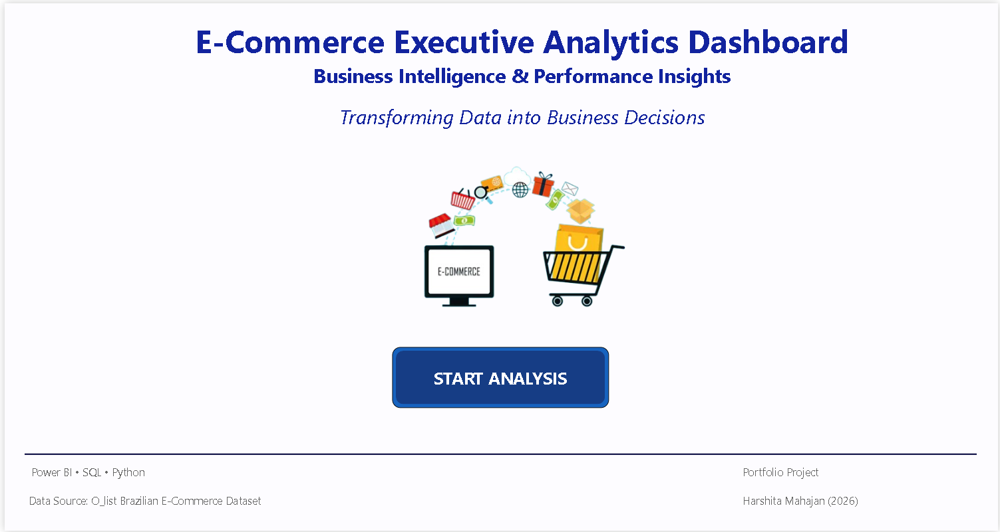
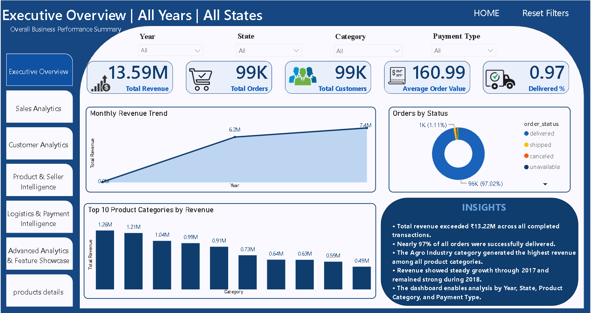
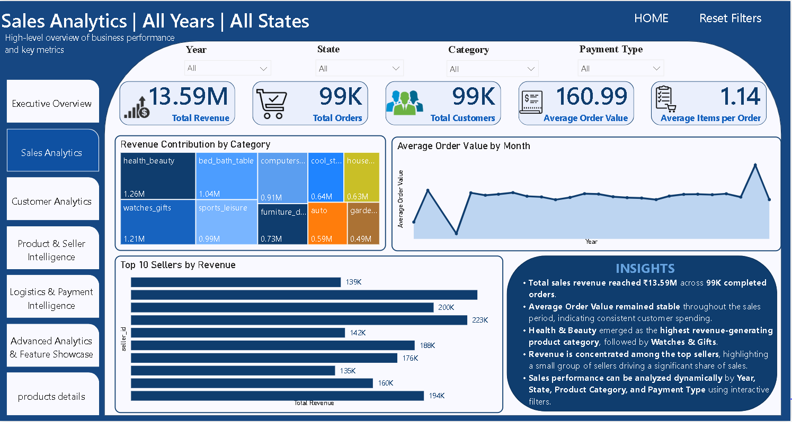
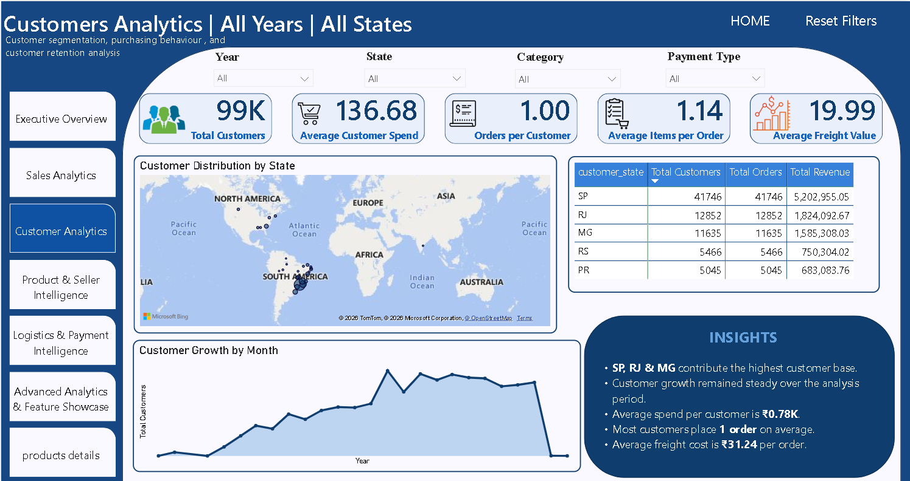
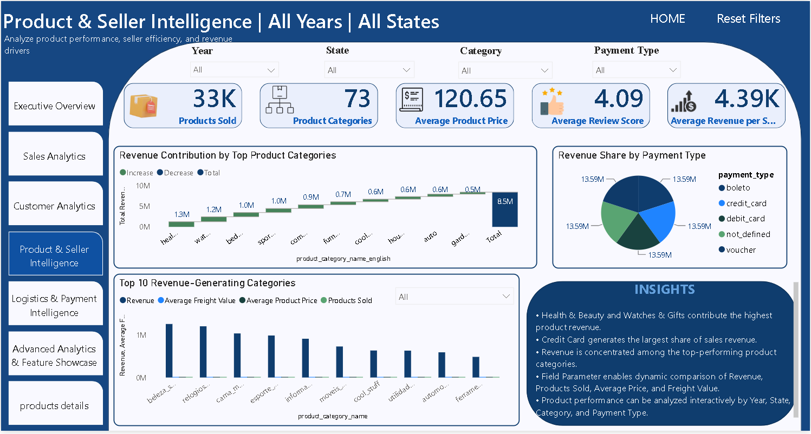
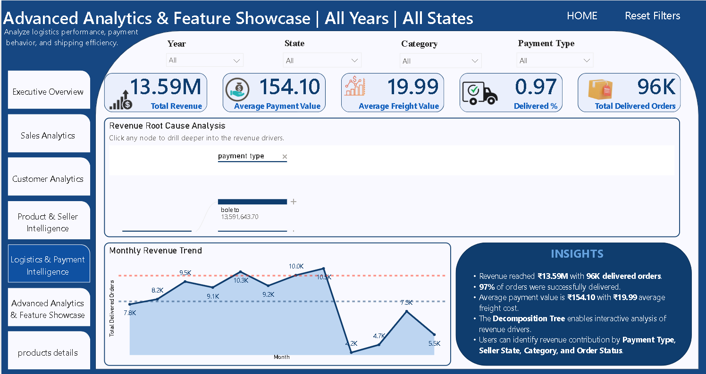
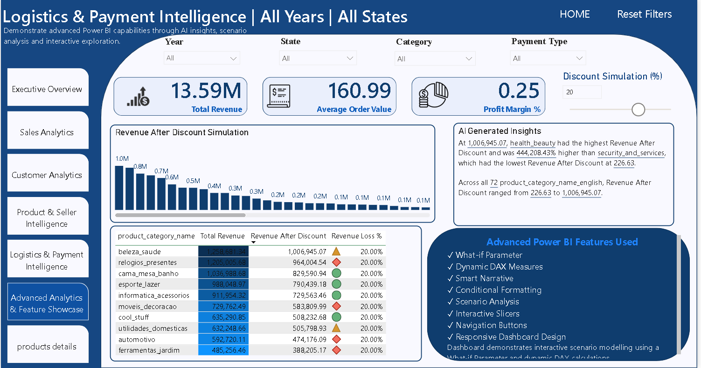

# Enterprise E-Commerce Business Intelligence Solution

## 📌 About the Project

This project is an end-to-end **E-Commerce Business Intelligence solution** developed to analyze customer, order, product, seller, sales, payment and logistics data.
The project transforms raw e-commerce data into cleaned datasets, exploratory analysis, SQL-based business insights and an interactive Power BI dashboard for understanding business performance and identifying important trends and patterns.

## 🛠️ Technologies Used

- Microsoft Excel
- Python
- Pandas
- NumPy
- Matplotlib
- Seaborn
- Plotly
- SQL
- MySQL
- Power BI
- DAX

## 📊 Dataset Scale

- 103,886 Customers
- 99,441 Orders
- 32,951 Products
- 3,095 Sellers
- 73 Product Categories

---

# 🔍 Module Analysis

## 🐍 Python — Data Cleaning & EDA

Used Python to clean, validate, transform and explore the e-commerce datasets.

**Tasks:** Data cleaning, missing-value handling, validation, transformation, EDA, visualization

**Features/Tools:** Pandas, NumPy, Matplotlib, Seaborn, Plotly

---

## 🗄️ SQL / MySQL — Business Analysis

Used SQL to analyze customers, orders, products, sellers, revenue, payments and categories.

**Tasks:** Filtering, aggregation, GROUP BY, JOINs, sorting, business analysis

**Features/Tools:** SQL, MySQL, cleaned analysis tables

**Cleaned Tables:**
- `customer_clean`
- `order_clean`
- `order_items_clean`
- `order_payments_clean`
- `products_clean`
- `sellers_clean`

---

# 📊 Power BI Dashboard

The Power BI report brings the cleaned and analyzed data together into an interactive multi-page Business Intelligence dashboard.

## 🏠 1. Welcome / Project Overview

Provides the project introduction, overall scope and dashboard navigation.

---

## 📈 2. Executive Overview

Provides a high-level view of overall business performance through revenue, orders, sales trends and key KPIs.

**Insight:** Provides a quick overview of overall business activity and performance trends.

---

## 💰 3. Sales Analytics

Analyzes revenue trends, order trends, sales performance and category-level sales patterns.

**Insight:** Helps identify changes in sales performance and revenue contribution across categories and periods.

---

## 👥 4. Customer Analytics

Analyzes customer distribution, customer activity and geographic patterns.

**Insight:** Helps understand customer concentration, activity and geographic distribution.

---

## 📦 5. Product & Seller Intelligence

Analyzes product categories, products sold, seller performance, revenue, average product price and average freight value.

**Dynamic Field Parameter Analysis:**
- Revenue
- Products Sold
- Average Product Price
- Average Freight Value

**Insight:** Enables comparison of product and seller performance using different business metrics.

---

## 🚚 6. Logistics & Payment Intelligence

Analyzes delivery performance, freight values, payment types, payment values and order status.

**Insight:** Helps identify logistics and payment patterns affecting order performance.

---

## 🧠 7. Advanced Analytics & Feature Showcase

Demonstrates advanced Power BI functionality through interactive scenario and root-cause analysis.

**Features:** What-If Discount Simulation, Dynamic DAX Measures, Scenario Analysis, Decomposition Tree, Smart Narrative

**Insight:** Allows exploration of discount scenarios and investigation of revenue drivers.

---

## 🔎 8. Product Details

Provides detailed product-level analysis using interactive tables and filtering.

**Insight:** Allows deeper investigation and comparison of individual product information.

---

# ⚡ Power BI Features Used

KPI Cards, Interactive Slicers, Filters, DAX Measures, Field Parameters, What-If Parameters, Decomposition Tree, Smart Narrative, Conditional Formatting, Drill-down, Tooltips, Navigation Buttons, Scenario Analysis, Cross-filtering, Interactive Tables

---

# 🎯 Project Outcome

The project demonstrates a complete Business Intelligence workflow:

**Raw Data → Python Cleaning & EDA → SQL/MySQL Analysis → Power BI → Business Insights**

It demonstrates practical skills in **data preparation, exploratory analysis, SQL business analysis, DAX, dashboard development, data visualization and Business Intelligence reporting.**

---

---

# 🎥 Dashboard Demonstration

### 📥 Explore the Dashboard

The complete Power BI report is available in the **`Power BI`** folder.

**Download the `.pbix` file → Open it in Microsoft Power BI Desktop → Explore the interactive dashboard**

The report includes interactive slicers, DAX measures, Field Parameters, What-If analysis, Decomposition Tree, drill-downs, tooltips and cross-filtering.

### 🎬 Video Demonstration

For a quick visual walkthrough of the dashboard and project, visit my LinkedIn profile:

🔗 **[Watch the project demonstration on LinkedIn](https://www.linkedin.com/in/harshita--mahajan)**

# 👩‍💻 Author

**Harshita Mahajan**

B.Tech Computer Science & Engineering  
Guru Nanak Dev University

🔗 **LinkedIn:** https://www.linkedin.com/in/harshita--mahajan

🔗 **GitHub:** https://github.com/harshita-mahajan-02
